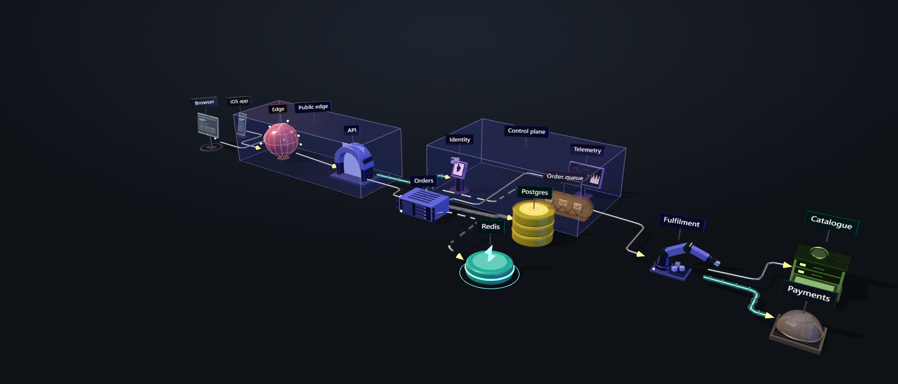
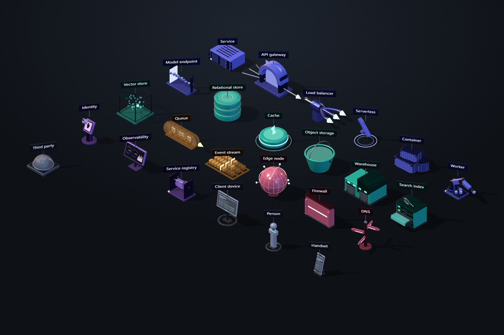

# Isoform

Machined 3D system architecture diagrams for the browser. Parts are modelled as
the objects they represent — a rack chassis, a shipping container, a bucket with
a handle, a signpost — under one locked studio rig.



One package: a part catalog, a document model, an orthogonal router, a renderer,
and an editor you mount with a single call.

## Install

```bash
npm install @satyadip28/isoform three
```

`three` is a **peer dependency**, deliberately. An app that already uses three
must not end up with two copies — that breaks `instanceof` across the boundary
and ships the runtime twice.

Requires WebGL2 and `three` >= 0.180.

Scoped because npm refused the bare name: *"Package name too similar to
existing package iso-form"*. Scoped packages skip that similarity check.

## Quick start

```ts
import { createEditor } from '@satyadip28/isoform'

const editor = createEditor(document.getElementById('app')!)
```

```html
<div id="app" style="width: 100vw; height: 100vh"></div>
```

That is the whole of it. The editor builds its own DOM and injects its own
styles — there is no markup to copy and no stylesheet to remember to import. It
fills the element you give it rather than positioning against the viewport, so
it works just as well in a panel, a split view or a modal.

## Recipes

### Open with a diagram written as text

Text carries no positions, so run `layout` over it before showing it — that is
the point of describing a system rather than placing it.

```ts
import { createEditor, parseDsl, layout, fitGroups } from '@satyadip28/isoform'

const { doc, issues } = parseDsl(`
  web    client   "Browser"
  api    gateway  "API"
  svc    service  "Orders"
  pg     database "Postgres"
  mq     queue    "Jobs"
  w      worker   "Fulfilment"

  web -> api
  api -> svc
  svc => pg
  svc ~> mq
  mq  -> w

  group "Backend" { svc, pg }
`)
if (issues.length) console.warn(issues)   // { line, message }[]

const { positions } = layout(doc)
for (const node of doc.nodes) node.pos = positions.get(node.id) ?? node.pos
doc.groups = fitGroups(doc)

createEditor(el, { doc })
```

**Connector kinds:** `->` sync, `~>` async, `=>` flow, `+>` secure, `<->`
duplex. A trailing `#` starts a comment; a trailing `#rrggbb` is a tint.

### Build a document in code

```ts
import { createEditor, emptyDoc, type Doc } from '@satyadip28/isoform'

const doc: Doc = emptyDoc()
doc.nodes = [
  { id: 'web', type: 'client',   label: 'Browser',  pos: [-4, 0], rot: 0 },
  { id: 'api', type: 'gateway',  label: 'API',      pos: [0, 0],  rot: 0 },
  { id: 'db',  type: 'database', label: 'Postgres', pos: [4, 0],  rot: 0, tint: '#3ED8BC' },
]
doc.edges = [
  { id: 'e1', from: { node: 'web' }, to: { node: 'api' }, kind: 'sync', route: 'auto' },
  { id: 'e2', from: { node: 'api' }, to: { node: 'db'  }, kind: 'flow', route: 'auto' },
]

createEditor(el, { doc })
```

`pos` is `[x, z]` on the ground plane in grid units; `rot` is yaw in radians.
Positions snap to 0.5u in the editor, but any value is legal.

### Persist what the user draws

```ts
import { createEditor, serialize, deserialize } from '@satyadip28/isoform'

const saved = localStorage.getItem('diagram')
const editor = createEditor(el, { doc: saved ? deserialize(saved) : undefined })

const stop = editor.onChange((doc) => {
  localStorage.setItem('diagram', serialize(doc))
})
```

`onChange` returns an unsubscribe. `editor.save()` gives you the document
directly if you would rather pull than subscribe.

### Render an image with no editor

For a thumbnail service, a CI artefact, or a docs build. Needs a WebGL context —
a headless browser will do — but no visible canvas and no user.

```ts
import { parseDsl, layout, fitGroups, renderDocument } from '@satyadip28/isoform'

const { doc } = parseDsl(source)
const { positions } = layout(doc)
for (const node of doc.nodes) node.pos = positions.get(node.id) ?? node.pos
doc.groups = fitGroups(doc)

const png = renderDocument(doc, { width: 1920, preset: 'hero' })
// a data: URL. preset is 'hero' | 'iso' | 'top'
```

Measured at roughly 850ms per render; the first call pays about 3s more to warm
the geometry and texture caches. The document is not modified.

### Mount it in React

```tsx
import { useEffect, useRef } from 'react'
import { createEditor, type Doc } from '@satyadip28/isoform'

export function DiagramEditor({ doc, onChange }: {
  doc?: Doc
  onChange?: (doc: Doc) => void
}) {
  const host = useRef<HTMLDivElement>(null)

  useEffect(() => {
    const editor = createEditor(host.current!, { doc })
    const stop = onChange ? editor.onChange(onChange) : undefined
    return () => {
      stop?.()
      editor.destroy()     // DOM, window listeners and the render loop
    }
  }, [])

  return <div ref={host} style={{ width: '100%', height: '100%' }} />
}
```

`destroy()` is required, not optional — an editor that outlives its container
keeps a WebGL context and a render loop alive.

### Trim the chrome

```ts
createEditor(el, {
  chrome: {
    title: 'Architecture',  // '' drops the wordmark entirely
    help: false,            // the keyboard-shortcut strip
    dsl: false,             // the Text button and its sheet
    files: false,           // PNG / Save / Load
  },
})
```

### Use the engine without the editor

Everything below the editor is exported: the part registry, the document model
and its undo stack, the router, the layout pass and the whole geometry foundry.
`createEditor` is one consumer of that, not a wrapper around it.

```ts
import { Stage, Reconciler, History, palette } from '@satyadip28/isoform'

const stage = new Stage({ canvas })
const reconciler = new Reconciler(stage.scene, {
  anchorIdle: palette('link').lit('lit', 0.9),
})
const history = new History(doc)

history.subscribe((doc) => reconciler.sync(doc))
```

The document model, layout, routing and serialisation are pure and run in Node
with no DOM — useful for validating or generating diagrams server-side.

## The catalog — 24 parts



| Group | Parts |
|---|---|
| Compute | Service · API gateway · Load balancer · Serverless · Container · **Worker** · **Model endpoint** |
| Data | Relational store · Cache · Object storage · Warehouse · **Search index** · **Vector store** |
| Messaging | Queue · Event stream |
| Edge & network | Edge node · Firewall · **DNS** |
| Control plane | **Identity** · **Observability** · **Service registry** |
| Client & external | Client device · **Handset** · **Third party** |

Ten of these were added after auditing the catalog against the AWS, Kubernetes
and network-diagram icon vocabularies. The gap that audit found was not breadth
— it was that the **operational plane was entirely missing**: a queue shipped
with nothing to consume it, and there was nowhere to put the thing that
authenticates, the thing that watches, or the thing that knows where everything
is. Those were being drawn as tinted services, which is as informative as not
drawing them.

The target is deliberately not parity with AWS's 900 icons. Twenty-four parts
that look like they came from one factory beat two hundred that look like a
clip-art folder, so each addition is modelled as the object it represents and
has to survive the catalog's own rule: **recognisable at 40px with no label.**

`ops` is a sixth category with its own colour — violet, between compute's indigo
and edge's rose — so a control plane reads as its own layer rather than
dissolving into the services it governs. `Category` is exported, and both the
DSL's accepted-category set and the editor's boundary-colour dropdown derive
from it rather than repeating the list.

Two parts sit in `client` that are not clients: **Handset** and **Third party**.
That category means *outside the system you are drawing*, and neutral slate is
right for all three — a third-party service is not yours to colour.

**Vector store is data and Model endpoint is compute.** A vector store is a
database and an inference endpoint runs computation; giving them a bespoke hue
would be marketing rather than information design.

## API

### `createEditor(container, options?)` → `Editor`

| Option | Type | Default | |
|---|---|---|---|
| `doc` | `Doc` | sample diagram | Document to open with |
| `chrome` | `ChromeOptions` | all shown | Which chrome to build |
| `debug` | `boolean` | `false` | Expose internals as `editor.debug` |

| Member | |
|---|---|
| `doc` | The document as it stands. Structurally shared — treat as read-only |
| `load(doc)` | Replace the document, discarding undo history |
| `save()` | Snapshot of the current document |
| `onChange(fn)` | Fires after any change. Returns an unsubscribe |
| `fit()` | Re-frame the camera on the diagram |
| `toPNG(width?)` | Data URL, without the editing scaffolding |
| `destroy()` | Remove the DOM, drop listeners, stop the render loop |

### Other entry points

| | |
|---|---|
| `parseDsl(text)` | `{ doc, issues }` — text to document |
| `layout(doc)` | `{ positions, ranks }` — layered auto-layout |
| `fitGroups(doc)` | Boundary boxes refitted to their members |
| `renderDocument(doc, opts?)` | PNG data URL, no editor |
| `serialize` / `deserialize` | Document to and from a JSON string |
| `MANIFESTS` / `PART_IDS` | The part catalog, as data |

## Keyboard

| | |
|---|---|
| Place | drag from the palette, snaps to 0.5u, `Alt` frees the snap |
| Select | click a part, connector or boundary; `Shift`+click to extend |
| Move | drag — one gesture is one undo step |
| Rotate | drag the ring, or `[` / `]`; snaps to 15°, `Alt` frees it |
| Group | `Ctrl`+`G`, `Ctrl`+`Shift`+`G` to ungroup; boundaries nest |
| Connect | hover for anchors, drag an anchor onto another part |
| Delete / duplicate | `Del` · `Ctrl`+`D` |
| Undo / redo | `Ctrl`+`Z` · `Ctrl`+`Shift`+`Z` or `Ctrl`+`Y` |
| Views | Hero · Iso · Top · `F` to fit |

## Developing this repo

```bash
npm install
npm run dev        # demo host              -> localhost:5173
npm run catalog    # M1 acceptance gate     -> localhost:5174
npm test
npm run typecheck
npm run build      # library, then the demo
npm run pack:check # tarball, as published
```

| Package | |
|---|---|
| `packages/isoform` | `@satyadip28/isoform` — the published library |
| `packages/demo` | private. A `<div>` and one `createEditor` call |

## License

MIT — see [LICENSE](LICENSE).

`three` is a peer dependency rather than a bundled one, so nothing third-party
ships inside the package: the tarball is `dist` and the licence, and three
arrives through the consumer's own install under its own MIT terms.

---

# Design notes

What follows is the engineering record: what the parts are, why the renderer is
shaped the way it is, and the defects found along the way.

## Layout

| Package | What it is |
|---|---|
| `packages/isoform` | `isoform` — the published library: foundry, parts, document model, router, reconciler, editor |
| `packages/demo` | `@isoform/demo` — private. A page with a `<div>` and one `createEditor` call |

It was two packages: an engine, and an editor that was a 1600-line script welded
to its `index.html` through thirty-six `getElementById` calls. That is fine for
an application and impossible for a library — mounting it anywhere else meant
copying a slab of markup and a stylesheet and keeping both in step by hand.

Two things closed the gap.

**The chrome moved into the library.** `editor/chrome.ts` builds the toolbar,
palette, inspector and text sheet and hands back typed references. No ids are
looked up, which is also what lets two editors share a page.

**The script became a factory.** The editor's module body is wrapped in
`createEditor` rather than converted to a class, so every `const` and `let` it
declared at module scope becomes closure state belonging to one instance. A
class conversion would have had to reproduce that by hand, statement by
statement, across 1500 lines — for identical behaviour and a much larger chance
of getting one of them wrong.

One thing worth knowing if you publish from here: `exports` used to point at
`./src/index.ts`. That resolves inside the workspace and hands raw TypeScript to
everyone outside it, so `npm run build` emitted a `dist/` that nothing ever
referenced. It now points at the built output, and `files` ships `dist` alone.

### Engine layers

Each depends only on the ones below it.

```
doc        schema · commands · history · io             ✅
render     stage · camera · reconciler                  ✅  (LOD, instancing → M5)
route      router · styles · obstacles · lanes          ✅
parts      manifests · builders · port geometry         ✅
foundry    geometry · materials · textures · env        ✅
```

**The Doc is truth.** Every user action becomes a `Command` run through
`History`; the `Reconciler` diffs the resulting Doc against the previous one and
patches the scene. Nothing in the editor moves an `Object3D` to represent a
change — it changes the document and lets the reconciler catch up. Undo, save
and load are consequences of that, not separate features.

`apply` is pure and `invert` is computed against the pre-state, so every command
satisfies `apply(apply(d, c), invert(d, c)) === d`. A 60-trial random-sequence
property test holds it to that.

### Manifest invariants, and the two defects they found

`manifests.ts` documented a contract between declared metadata and built
geometry, and claimed a `manifests.test.ts` enforced it. That file did not
exist. Writing it before adding ten parts turned up two footprints that had been
wrong since they were authored:

- **gateway** declared depth 1.16 against a 1.05 body. 1.16 is the *service*
  chassis depth, copied from the entry above it.
- **balancer** declared 2.78 × 1.3 against a 2.43 × 1.19 body — it had been
  measured with the flow arrows included, and those are stubs, struck the moment
  a real connector lands.

Both over-declare, which is the harmful direction: a footprint reserves ground
for snapping and stands as an obstacle for the router, so an inflated one pushes
neighbours away and creates a phantom wall to route around. Neither symptom
points back at the manifest.

A third turned up later, in `monitor`: 1.61 declared against a 1.5 panel, because
a slab meant to mask the strip chart overhung the panel's right edge. The test
had measured the defect faithfully and the manifest had recorded it.

The test measures the **body** — `stripStubs` already encodes which geometry is
decorative, so it reuses that judgement rather than inventing a second one — and
allows 0.02u of slack, because every box here is an extrusion with a bevel and a
part authored 1.84 wide measures 1.8397. It also checks part numbers are unique,
anchors sit inside the part, nothing floats off the ground, and every part with
an `update` declares what that update touches.

### Building a part must not change the next one

The foundry memoises geometry, so what a builder receives is shared with every
other user of that size. `monitor` moved a needle's pivot by translating its
geometry in place — which mutated the cache, twice per part, so the pivot drifted
**0.13 further out with every monitor built**: 0.13, then 0.26, then 0.39, and
the shared box stayed corrupted for anything else that asked for that size.

Nothing about it is visible at the call site, and one monitor in isolation looks
fine. `manifests.test.ts` now builds every part four times and compares a
positional fingerprint of the first against the last. Offsets belong on a parent
group; geometry from the foundry is not yours to move.

Running it needs a canvas, because materials carry generated texture maps.
`vitest.setup.ts` stubs the eleven write-only 2D calls the foundry makes rather
than pulling in jsdom, which ships no 2D context and would fail in the same
place. Textures affect how a surface looks, never where a vertex sits, so a
no-op canvas is the honest stub for geometry tests.

## Connector anchors

**Every part has the same four anchors** — N/E/S/W at the centre of each
footprint face. Manifests declare only `portY`, the height connectors meet the
part at; the anchors are derived, so no part can drift out of the model.

Parts used to declare their own semantic port sets (gateway three-in/one-out,
queue in/out, boundary none), which meant you could not predict where a
connector would attach without knowing the part. Uniform anchors make snapping
guessable, which is what makes it fast.

Nothing is lost. Two mechanisms carry the semantics that model held:

- **Facing-aware auto-snap.** `choosePortPair` scores all sixteen candidate
  pairs by separation, penalised by how far each anchor's outward normal points
  away from the other part. Picking on raw distance alone produces routes that
  leave the back of a part and wrap around it — the most common way 3D
  connectors look wrong.
- **Fan-spreading.** Several connectors may share one anchor and are spread
  across that face by slot, so a gateway still reads as multiple routes arriving
  on one side.

In the editor: hover a part to reveal its anchors, drag from one onto another
part, `Esc` to cancel. The anchor you drag from is pinned on the resulting link;
the far end stays automatic.

**Connectors are selectable objects.** Click one to select it, `Del` to remove
it, and the inspector shows what it joins and lets you change its style. Until
this landed a link could be created but never removed except by deleting a part
and letting the cascade take it.

Hit-testing uses an invisible fat tube along each route, the same technique as
the node pick volumes — a connector is 0.035u across, a few pixels at normal
framing, and hit-testing what is drawn would make it effectively unclickable.
Parts win ties: a run passing in front of a chassis does not swallow clicks meant
for it. The pick volume doubles as the highlight, so selection draws a sleeve
along the route rather than a box around its bounds, which for a long orthogonal
path would enclose half the diagram.

## Status — M5 met

The plan's M5 budget was 150 nodes at ≥55fps, under 400 draw calls, first
interaction under 1.5s. Measured on the stress document, 24 part types cycled
across 150 nodes with 140 connectors:

| | Before | Now | Budget | |
|---|---|---|---|---|
| Render | 67 ms · 15 fps | **15 ms · 64 fps** | ≥55 fps | ✓ |
| Draw calls | 2431 | **363** | <400 | ✓ |
| First build | 1250 ms | **135 ms** | <1.5 s | ✓ |
| Triangles | 4.99 M | 3.22 M | — | |
| Drag frame | 74 ms | **35 ms** | | |
| Routes recomputed per drag frame | | 1 / 140 | | ✓ |

With all five connector kinds mixed rather than all `sync` — the harder case,
since `async` is nine dashes and `flow` carries animated packets — the same
document costs 491 calls at 28ms. Under the call budget; short of 55fps.

Four things got it there, in the order measuring said to do them.

### The frame was call-bound, not triangle-bound

Worth stating because it was not obvious and it decided everything after it.
Halving the catalog's triangle count bought **11ms of a 67ms frame**. The other
56ms was the 2431 draw calls themselves. Every subsequent change targets call
count, and the one that reduced triangles was worth doing on its own terms
rather than for the frame rate.

### Fillet segments scaled to the fillet

`roundedBox` is the most-used primitive in the catalog by an order of magnitude,
and every one was extruded at 12 curve segments and 3 bevel segments regardless
of size. A 0.008u corner — two pixels at any framing a diagram is read at — cost
the same as a 0.2u one. Tying both to the radius cut the catalog **58%**, from
388k triangles to 163k, with no visible difference at palette size.

The floor matters: at two segments the inscribed corner cuts in far enough to
*shrink the part*, and the client's panel lost 25mm of its 1.56u width — enough
to break the footprint invariant. Four holds every part inside tolerance.

### Instanced nodes

Every node of the same type, tint and stub state draws identical geometry with
identical materials, differing only by transform. One `InstancedMesh` per merged
piece per type: **967 node draw calls → 134**, and 24 batches for 150 nodes.

Instances stay dense — removal swaps the last member into the hole — so a drag
rewrites one matrix and touches nothing else. A node leaves its batch when it
goes to full detail, because the articulated rig draws the same geometry and
leaving the instance behind shows as z-fighting across every surface, not as a
quiet overdraw.

Transparent pieces are batched too, against the usual advice. They were 198 of
the 601 remaining calls, more than every opaque surface combined. The cost is
that instances within a batch are not depth-sorted against each other; each one
is a small lit decal on its own part, so two overlapping on screen is rare.

### Merged connectors, and why a drag does not undo it

Connectors were then the single largest cost: 560 calls and 22.6ms. Each is only
a tube and an arrowhead, but there is one of each per connector and no two share
geometry — though they do share *materials*, and they are built in world space,
so concatenating them costs nothing but the concatenation.

The first version dropped the merge for the duration of any gesture. Correct,
and it cost **2659 calls against 491 at rest** — a 74ms frame — because the whole
diagram's tubing went back to one mesh apiece to accommodate the two or three
routes actually moving. Now only the changing routes leave the buffer, and the
merge is rebuilt only when its membership changes or something inside it does.
A drag holds at 495 calls.

Animated connectors are merged only past 96 of them: merging a `flow` conduit
freezes its packets, and that animation is most of what distinguishes a data flow
from a plain call.

### What landed earlier

### Merge pass and LOD

Each part type is flattened once into a handful of geometries — one per material,
local transforms baked — and every instance shares them. Node draw calls at 150
nodes are **1020 instead of ~4500**.

Nodes render merged unless selected or hovered, or the diagram is under 24 nodes.
The honest cost: a merged part's moving pieces hold still. The cache halo stops
pulsing, the queue's envelopes stop travelling, the balancer's vane holds. They
resume the moment you hover or select.

Stub state is part of the merge key rather than toggled afterwards — once meshes
are concatenated there is no per-mesh visibility left to switch, so a part that
can appear connected or unconnected needs one merged form of each.

### Incremental routing

Routes are cached against a signature and recomputed only where something
changed. Two things make that correct rather than merely fast, and both were
found by a test that compares the cached path against a fresh one:

- **A route depends on every part, not just its two endpoints** — each one is an
  obstacle. Moving a node reshapes routes that do not touch it. Reuse is
  therefore also gated on locality: a cached route whose bounding box overlaps
  the region a node vacated or newly occupies is recomputed.
- **Lane allocation is order-dependent**, so reused claims must re-enter the
  allocator in document order, and any recompute invalidates later lane-holding
  reuse. Narrower rules were tried and diverged — which would have meant a
  dragged diagram and a reloaded one disagreeing.

A gesture resolves in *interactive* mode, which relaxes both the lane-order rule
and the search rung; the exact pass runs on commit (270 ms at this scale). The
split is deliberate: a frame of a drag does not need final-quality routing.

### Three performance bugs, all found by measuring

- **A\* tested every lattice cell against every part** — millions of checks for a
  long route in a dense diagram, enough to wedge the renderer outright. Marking
  cells by walking obstacles instead made a 150-node resolve go from effectively
  hung to 91 ms. Its open list is a binary heap now, not a linear scan.
- **A\* fired during drags.** With a crowded lane allocator the double elbow's
  mid-line gets pushed into other parts and the ladder falls through to search —
  8.2 ms per recomputed edge, against 0.84 ms in a cold pass. Search is off in
  interactive mode: 69 ms → 18 ms per drag frame.
- **`applyTransform` rebuilt anchors for all 150 nodes every sync**, reproducing
  positions that were already correct.

### What is still open

- **Mixed connector kinds cost 28ms**, against 15ms for a uniform document. The
  remaining weight is `async`, which builds nine separate dash meshes per
  connector before merging can fold them.
- **Tint is a batch key, not an instance attribute.** Twenty nodes in twenty
  different colours are twenty batches. `instanceColor` would collapse them, but
  it needs a white base material and gives `lit` finishes no per-instance
  emissive, so the two would have to be handled differently — worth doing only if
  heavily tinted documents turn out to be common.
- **The shadow pass is roughly half of all draw calls.** Cheaper than it was, but
  still the largest single multiplier on the frame.

## Status — M4 complete

The first genuinely usable release. A diagram can be described, laid out,
labelled, bounded and exported without touching the mouse.

### Describe it in text

`Text` in the toolbar. Nodes then edges; positions are deliberately not
expressible, because describing a system should not require placing it.

```
web      client    "Browser"
api      gateway   "API"
orders   service   "Orders"
pg       database  "Postgres"

web  -> api        # sync
api  -> orders
orders => pg       # flow
api  ~> orders     # async
web  +> api        # secure
api <-> orders     # duplex

group "Service tier" { orders, pg }
```

Import only. Round-tripping back out means preserving comments, declaration
order and every manual override made in the viewport — a project of its own, and
one that silently loses work when it gets it wrong.

Parsing never throws: an unparseable line becomes an issue and is skipped, so one
typo in a long spec does not cost the whole diagram.

`#` serves as both comment marker and hex-colour prefix, so it is exempt inside a
quoted label and when followed by exactly six hex digits.

### Tidy

Layered (Sugiyama) layout: break cycles, rank by edge direction, order within
rank by the median heuristic, then assign grid coordinates. Ranks advance along
+x because that is the direction the locked camera reads. Emitted as one batch
command, so a mis-aimed Tidy costs a single Ctrl+Z rather than sixty.

Written out rather than pulled from dagre, which the plan had called for. That
reasoning held until the integration was examined: dagre wants sizes in its own
units, returns centres in its own conventions, knows nothing of the 0.5u grid,
and would need teaching about ranking direction anyway. The adapter was most of
the algorithm's length with none of its clarity.

### Labels

A small machined tag floating above its part: an upright plate with real
thickness, carrying canvas text, tinted to the part's category. Not an HTML
overlay — a PNG or glTF of a diagram whose labels lived in the DOM comes out
unlabelled — and a solid object rather than a decal, so it takes the studio
lighting and reads as part of the assembly.

The tag turns about Y to face the viewer, and only about Y: tilting to meet a
raised camera makes it read as a floating sticker rather than a plate standing in
the scene.

A thin stem drops from the tag to the part's apex. That is what lets the
declutter pass slide a crowded tag sideways without breaking the association — it
becomes a leader line instead of a label hovering over the wrong object.
Resolution is along the camera's right vector only, since moving a tag toward or
away from the viewer would break the association outright.

Text is sized against the parts, not the page. An earlier version lay flat on the
ground at 0.2u cap height and rendered about eleven pixels tall — present but
unreadable; a floating tag is nearer the eye, unobstructed and always square to
the viewer, so it carries at 0.24u.

### Groups

Select parts (`Shift`+click to add), then `Ctrl`+`G`. `Ctrl`+`Shift`+`G`
ungroups. Click a boundary to select it and the inspector offers its label,
category colour, membership and delete.

`DocGroup` records the ids it encloses and `fitGroups` derives the box from them.
A boundary that stored only its own extent would go stale the moment a member
moved, so the box is a consequence of membership rather than a stored fact.
Anything that moves, adds or removes a member emits the refit **in the same
batch**, so no point in the undo stack shows a part that has moved out of a tier
that has not resized.

**Groups nest.** Members may be group ids as well as node ids, so selecting a
boundary and pressing `Ctrl`+`G` wraps it in a larger one. `fitGroups` resolves
inner boxes before the outer ones that depend on them, and guards against a group
listing itself directly or through a chain.

Membership is edited from the inspector, not by dragging parts into the volume.
"Inside the box" is a consequence of the box being fitted to its members, not the
definition of membership — inferring one from the other would make a part join a
tier merely by being moved near it.

The boundary's pick shell is `BackSide`, so a ray passes through the near face
and registers on the far one: clicking inside a boundary reaches what is in
there, and only the enclosure itself selects the enclosure.

### Export

PNG renders off-screen at 3840px wide, so an export is not limited by the window
it was taken from. Grid, anchors and selection outlines are hidden; every
renderer and scene setting is restored on the way out, including on the error
path. Measured: 2400×1350 in 249ms, ~1MB.

### Known limits

- glTF export is not built. Emissive-heavy parts and the `ShadowMaterial`
  catcher export imperfectly and need handling, so it was not worth a rushed pass.
- Declutter is a two-pass relaxation, not a solver. Plates on adjacent rows at
  different depths can still touch.
- The DSL has no syntax for rotation, tiers (`y`), manual waypoints or per-edge
  labels — all of which the document model supports.

## Status — M3 complete

Connectors route themselves around obstacles and survive node movement.

**The ladder**, in preference order, each rung accepted only if it clears every
part's footprint inflated by 0.3u:

1. **Direct** — but only when the two anchors genuinely line up. A collision-free
   diagonal is still the wrong shape: this language is Manhattan, and a long
   slanted run reads as a mistake even when nothing is in its way.
2. **Single elbow**, both orientations, shorter first.
3. **Double elbow**, with the mid-line taken from the lane allocator.
4. **A\*** on the 0.25u lattice, with a turn penalty so paths prefer long
   straight runs over staircases.

If nothing clears, the shortest elbow is used anyway — an overlapping edge beats
a silently dropped one.

**Lanes.** Routes sharing a corridor would render as one thick line. Rather than
offsetting finished geometry, which breaks the joins, the router asks the
allocator for its turn coordinate and gets the nearest free lane at 0.17u
spacing — the offset the catalog's bidirectional connector already used.

**Rotation is exact.** Obstacle tests transform the segment into each part's own
frame rather than using the rotated AABB, which would cost 41% extra width on a
45° part and make the ladder fall through to A* for no reason.

### Measured

At 60 nodes / 54 edges of mixed connector styles:

| | |
|---|---|
| Resolve all routes | 11.5 ms |
| Drag frame (2 incident edges rebuilt) | 19.8 ms · ~50 fps |
| Edges re-tubed on a leaf drag / hub drag / no-op | 1 / 4 / 0 |

Three things got it there, each found by profiling rather than guessed:

- **`toLocal` recomputed `cos`/`sin` per call** — ~324k trig calls per resolve.
  Precomputing them on the obstacle plus a bounding-circle broad-phase took
  resolution from 26 ms to 11.5 ms.
- **`Curve.getLength()` builds a 200-entry arc-length table**, so sizing a tube
  by its curve cost more than the geometry it sized. Segment counts now come
  from the polyline, which the caller already holds.
- **The dashed style built nine separate tube geometries**, making it the most
  expensive connector by a wide margin at 17.9 ms. They are merged into one.

### Known limits

- Resolution is O(edges) per frame, so a drag at 200 edges would be ~40 ms.
  Making it incremental means caching per-edge resolutions and seeding the lane
  allocator with unchanged claims — real work, scheduled for M5 with LOD and
  instancing.
- A\* paths are not lane-separated; only the double-elbow rung is. In practice
  A\* fires rarely, but two searched routes through the same gap can overlap.
- Manual waypoints bypass the ladder entirely and are not obstacle-checked.

## Status — M2 complete

The editor is usable. Drag a part from the palette onto the grid, connect it,
move it, undo it, save it.

| | |
|---|---|
| Place | drag from palette · snaps to 0.5u · `Alt` frees the snap · ghost turns red on footprint collision |
| Select | click a part, connector or boundary · `Shift`+click to extend · click empty space to clear |
| Move | drag · one gesture is one undo step |
| Rotate | drag the ring · `[` and `]` · inspector buttons or a typed angle · snaps to 15°, `Alt` frees it |
| Group | `Ctrl`+`G` · `Ctrl`+`Shift`+`G` to ungroup · boundaries nest |
| Connect | hover for anchors, drag anchor → part |
| Delete / duplicate | `Del` · `Ctrl`+`D` |
| Undo / redo | `Ctrl`+`Z` · `Ctrl`+`Shift`+`Z` or `Ctrl`+`Y` |
| Views | Hero (locked 32° pose) · Iso (true orthographic) · Top · `F` to fit |
| Files | Save / Load `.isoform` JSON |

Connector styles now render per edge kind: `sync`, `async` (9 dashes at 58% duty
on a raised arc), `duplex` (two runs offset ±0.17u, opposed heads), `flow`
(acrylic conduit, steel collars, travelling packets) and `secure` (lit core in a
clamped sheath).

### Picking and pointer coordinates

Worth knowing, because three separate symptoms all came from the same place.

The canvas gets its size from CSS (`width/height: 100%`) and its backing store
from `setSize(w, h, false)`. Both halves are load-bearing: a canvas whose backing
store exceeds its CSS box *and* has no stated CSS size lays out at its intrinsic
pixel size, so at devicePixelRatio 1.5 a 1280×720 viewport gets a 1920×1080
element anchored top-left. The view reads as zoomed and off-centre, and every
pointer coordinate is off by the same factor — the cursor has to sit well away
from a part to hit it.

Writing the CSS size imperatively instead is worse: an inline size beats the
stylesheet, so a single call made before layout settles pins the canvas at 0×0
for good.

Consequently:

- Pointer NDC comes from `canvas.getBoundingClientRect()`, never from
  `window.innerWidth/Height`. The two agree only while layout is settled.
- Sizing is driven by a `ResizeObserver` on the canvas, *plus* an immediate call
  at boot — the observer only delivers at paint time, so a hidden or background
  tab would otherwise open on an unframed camera and stay there.
- `devicePixelRatio` is re-read on every resize, since browser zoom and moving
  between displays both change it.
- Pick volumes are the declared footprint padded by 0.2u, and tall enough to
  cover the *measured* silhouette rather than the nominal height — clicking the
  top of the gateway's arch selects the gateway.
- Hovering draws an outline. Without it there is no way to tell what a click will
  hit, so a miss is indistinguishable from a broken tool; this was the largest
  part of "selection is unreliable".
- Dragging happens on a horizontal plane through the point actually grabbed, not
  through y=0. Dragging on the ground while holding the top of a tall part makes
  the object lag the cursor by the parallax between those heights.
- Pointer-down on a part is handled in the capture phase and stops propagation,
  so OrbitControls never begins an orbit; a click-drag used to both select and
  swing the camera.

### Known gaps

- No box-select. Multi-selection is `Shift`+click only, one part at a time.
- Boundaries do not rotate. Their box is derived from member footprints, and a
  turned enclosure would need an oriented fit the layout pass does not compute.

## Status — M1 complete

The foundry and part registry are ported and verified. All 21 catalog parts (14
primitives + 7 connector specimens) build from the registry, plus a `boundary`
part promoted out of the catalog's inline assembly code.

Run `npm run catalog` and open it beside the source HTML. Every tile is driven
by the registry, so any part that renders differently means the port is wrong.
The page exposes `window.__gate` for `stats()`, `contactSheet()`, `tileImage(id)`
and `footprintAudit()`.

### What changed from the catalog, and why

**Materials are cached and role-tagged.** The catalog mints a fresh
`MeshPhysicalMaterial` on every `FINISH.*` call — fine for 14 tiles, hundreds of
redundant shader programs at 150 nodes. Everything is now keyed and shared: the
whole catalog runs on **72 materials and 114 geometries**, and building five more
`service` and five more `cache` instances adds **zero** of either.

The catalog also recovered a material's role by comparing its hex against the
`HUE` table, which breaks silently the moment two categories share a colour.
Materials now record their own category and role in `userData`, so builders say
`P.powder('body')` rather than `FINISH.powder(c.body)` and retinting is a lookup.

**Geometry is memoised, not cloned.** The plan called for building each part once
and cloning it. Cloning shares geometry but breaks animation — each part's
`update` closure captures its own meshes and materials, so every clone would
drive the prototype and all instances would move in lockstep. Memoising one level
down gets the same sharing while builders stay plain constructors. Verified: two
`cache` instances share the collar ring material but hold **private** halo
materials, and animating one leaves the other untouched.

**Surface presets are cache keys.** The four places the catalog mutates
`normalMap`/`roughnessMap` after construction (vent, corrugation, shutter, brick)
would leak across every sharer of a cached material, so they became part of the
key. Same for the gateway aperture's `DoubleSide`.

**Materials an `update()` mutates are private.** The cache halo and firewall slit
drive `emissiveIntensity` per frame and opt out of the cache via `unique: true`.

**Textures are deterministic.** The catalog seeds its noise from `Math.random()`,
so no two page loads match. Everything now draws from a seeded stream — the same
diagram exports the same PNG twice.

**Modelled connector stubs are strippable.** Several parts have connections built
into the model — the gateway's three input pipes and lit output arrow, the
balancer's flow arrows, the queue's exit arrow. They read well in isolation,
which is what a catalog needs, but in a diagram they dangle into empty space and
double up with the real routed edge. They are tagged with `stub()` and removed by
`stripStubs()` from any node that terminates an actual connection. The catalog
gate never calls it, so the palette still shows parts as designed.

### Deliberate deviations

- **Client screen (fixed).** The catalog places the browser-window plane at
  z=0.043 inside a recess plate spanning 0.026–0.046, so the panel renders solid
  black — defeating the one thing the part exists to show. Moved to 0.048.
- **Shadows.** r185 removed `PCFSoftShadowMap` and substitutes `PCFShadowMap`
  with a warning. We name the substitute explicitly. A/B against `VSMShadowMap`
  was indistinguishable at the locked camera.
- **Footprints.** Hand-declared, then corrected against measured geometry.
  `footprintAudit()` fails if a footprint claims more ground than the part
  occupies. Two parts deliberately declare *less*: the gateway excludes ~2u of
  modelled pipework and the queue excludes its exit arrowhead, because those
  represent connections and must not block routes.

### Known, not yet addressed

- The browser and stage textures carry `NoColorSpace`, matching r128's default.
  `SRGBColorSpace` is more correct but would diverge from the gate baseline —
  worth revisiting deliberately rather than drifting into.

## Design rules

Locked before any new part ships. These live in code in `foundry/geometry.ts`.

| | |
|---|---|
| Grid unit | 0.25u |
| Global fillet | 0.06u on every hard edge — zero perfectly sharp edges |
| Camera | 32° lens, azimuth 34°, elevation 24° |
| Connectors | tube radius 0.05u, arrowhead 2.5× radius, 0.28u corner rounding |
| Silhouette | recognisable at 40px with no label |
| Micro-surface | every material carries a noise roughness map |

## Next

**M2** — document model, reconciler, palette drag, grid snap, gizmos, undo/redo.
See the plan for the full phase breakdown.
